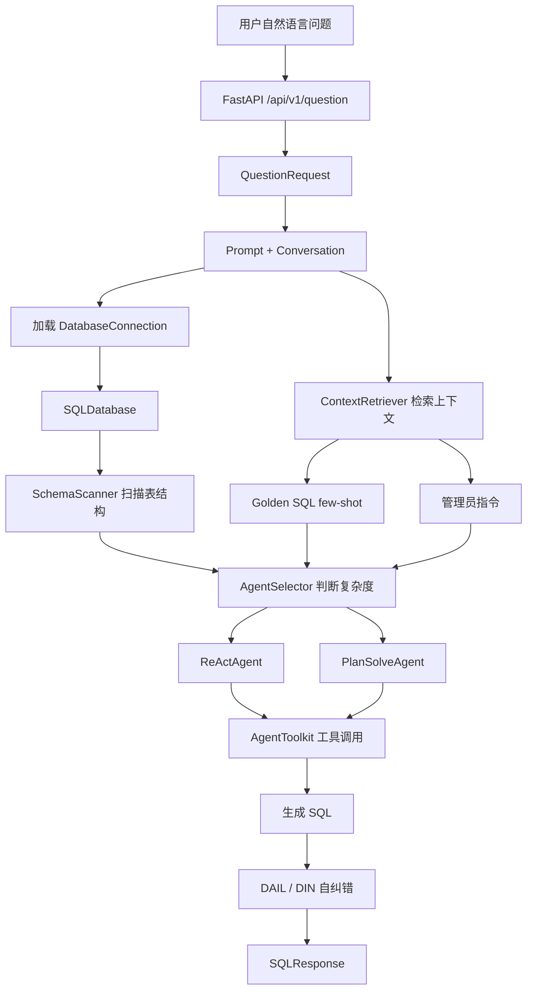
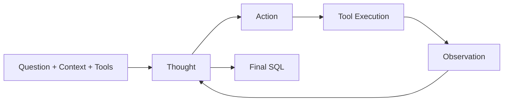
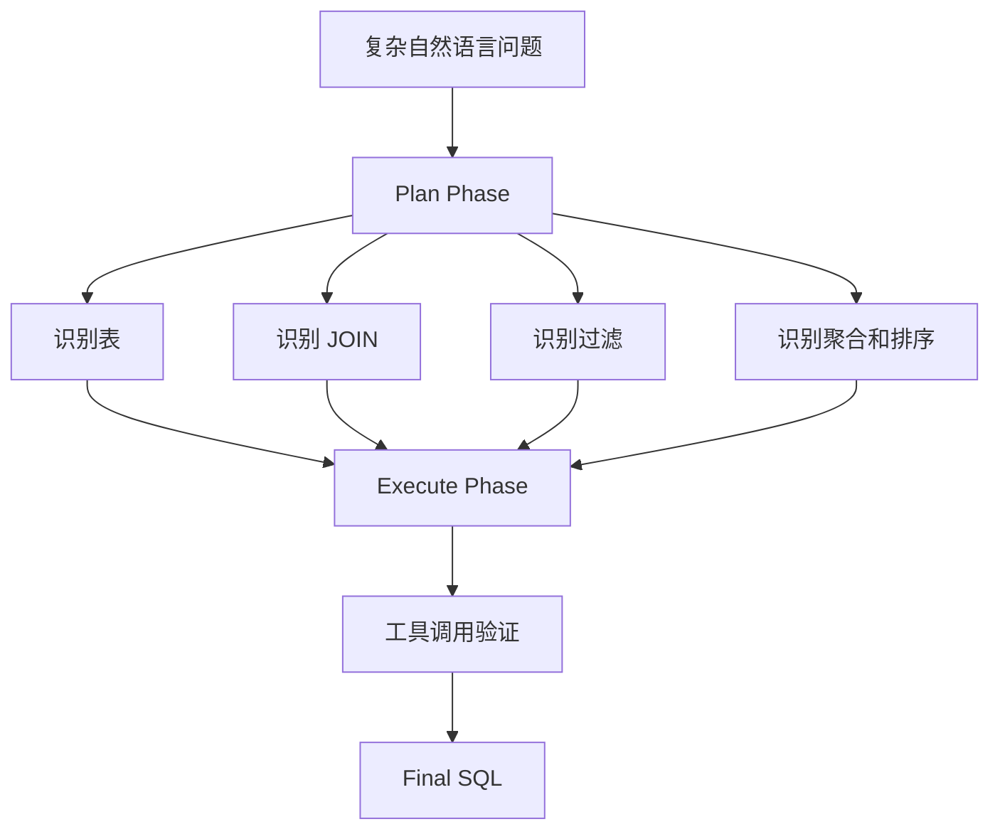
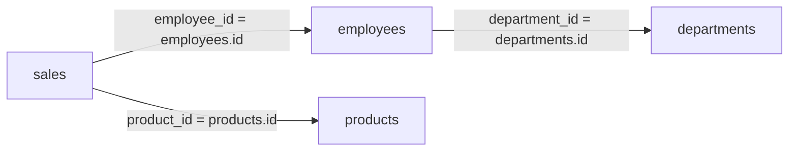
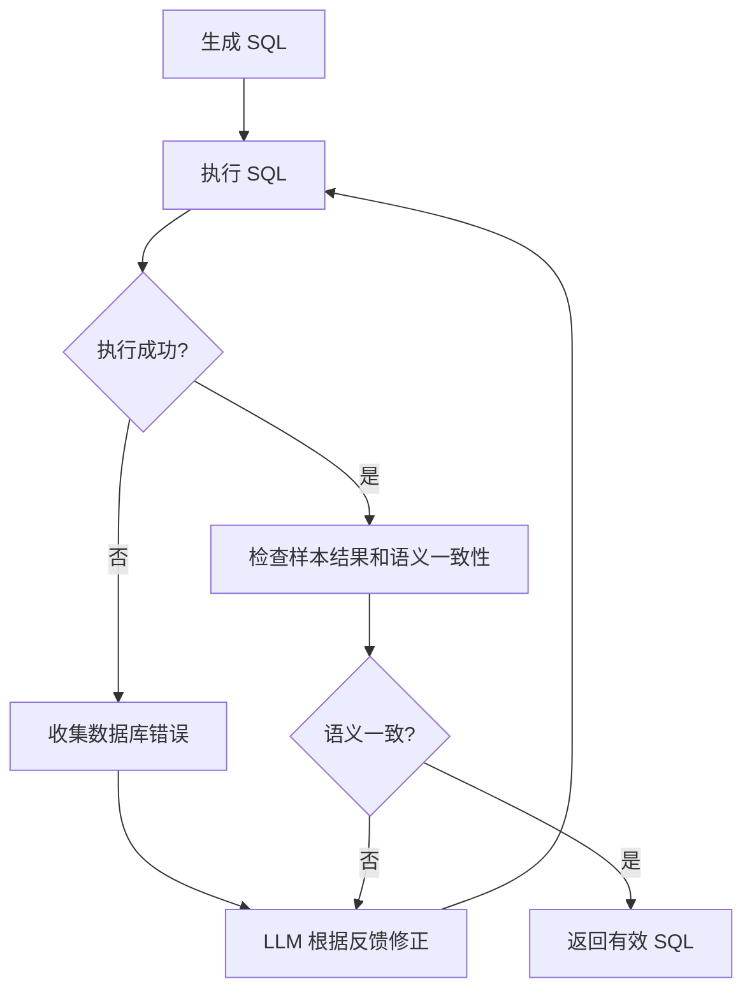
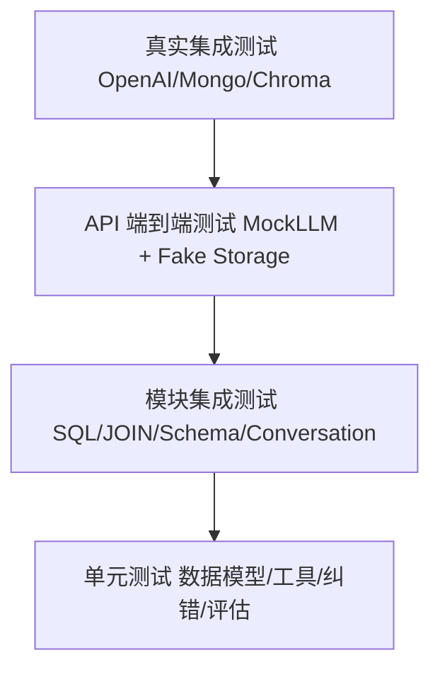
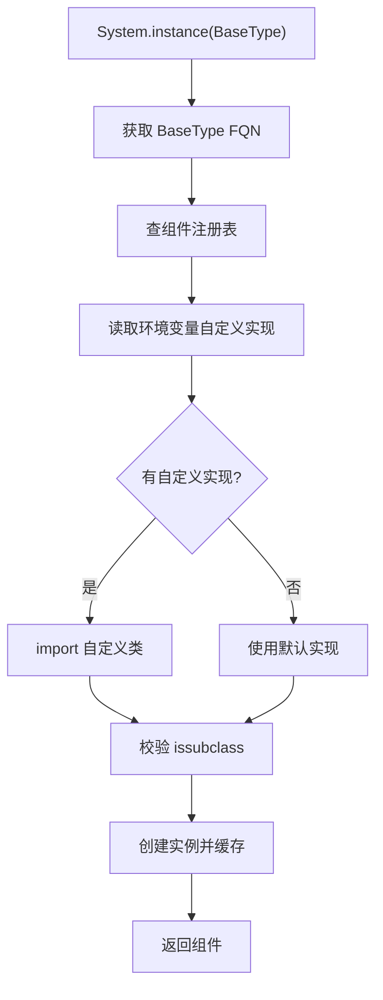

# SQL Agent 核心图谱

## 1. NL->SQL 主链路

```mermaid
flowchart TD
    A["用户自然语言问题"] --> B["FastAPI /api/v1/question"]
    B --> C["QuestionRequest"]
    C --> D["Prompt + Conversation"]
    D --> E["加载 DatabaseConnection"]
    E --> F["SQLDatabase"]
    F --> G["SchemaScanner 扫描表结构"]
    D --> H["ContextRetriever 检索上下文"]
    H --> H1["Golden SQL few-shot"]
    H --> H2["管理员指令"]
    G --> I["AgentSelector 判断复杂度"]
    H1 --> I
    H2 --> I
    I --> J["ReActAgent"]
    I --> K["PlanSolveAgent"]
    J --> L["AgentToolkit 工具调用"]
    K --> L
    L --> M["生成 SQL"]
    M --> N["DAIL / DIN 自纠错"]
    N --> O["SQLResponse"]
```

## 2. ReAct 循环

```mermaid
flowchart LR
    A["Question + Context + Tools"] --> B["Thought"]
    B --> C["Action"]
    C --> D["Tool Execution"]
    D --> E["Observation"]
    E --> B
    B --> F["Final SQL"]
```

## 3. Plan-and-Solve 流程

```mermaid
flowchart TD
    A["复杂自然语言问题"] --> B["Plan Phase"]
    B --> C["识别表"]
    B --> D["识别 JOIN"]
    B --> E["识别过滤"]
    B --> F["识别聚合和排序"]
    C --> G["Execute Phase"]
    D --> G
    E --> G
    F --> G
    G --> H["工具调用验证"]
    H --> I["Final SQL"]
```

## 4. Schema Linking 外键图

```mermaid
flowchart LR
    S["sales"] -->|employee_id = employees.id| E["employees"]
    E -->|department_id = departments.id| D["departments"]
    S -->|product_id = products.id| P["products"]
```

## 5. 自纠错闭环

```mermaid
flowchart TD
    A["生成 SQL"] --> B["执行 SQL"]
    B --> C{"执行成功?"}
    C -->|否| D["收集数据库错误"]
    C -->|是| E["检查样本结果和语义一致性"]
    D --> F["LLM 根据反馈修正"]
    E --> G{"语义一致?"}
    G -->|否| F
    G -->|是| H["返回有效 SQL"]
    F --> B
```

## 6. 测试金字塔

```mermaid
flowchart TD
    A["真实集成测试 OpenAI/Mongo/Chroma"] --> B["API 端到端测试 MockLLM + Fake Storage"]
    B --> C["模块集成测试 SQL/JOIN/Schema/Conversation"]
    C --> D["单元测试 数据模型/工具/纠错/评估"]
```

## 7. IoC 组件实例化

```mermaid
flowchart TD
    A["System.instance(BaseType)"] --> B["获取 BaseType FQN"]
    B --> C["查组件注册表"]
    C --> D["读取环境变量自定义实现"]
    D --> E{"有自定义实现?"}
    E -->|是| F["import 自定义类"]
    E -->|否| G["使用默认实现"]
    F --> H["校验 issubclass"]
    G --> H
    H --> I["创建实例并缓存"]
    I --> J["返回组件"]
```
