# SQL Agent 核心图谱

## 1. NL->Data Answer 主链路

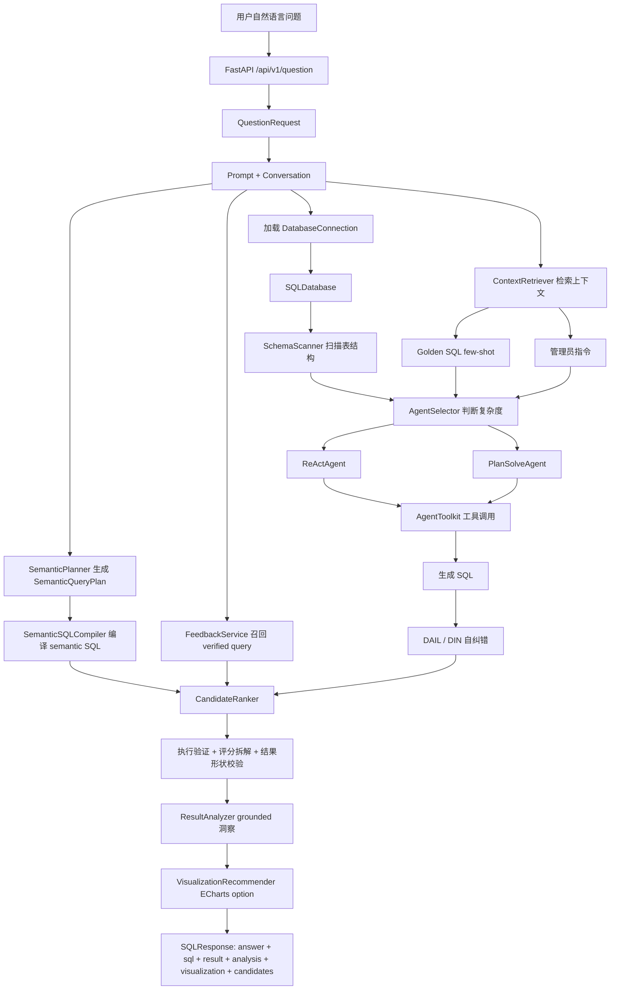

## 2. ReAct 循环

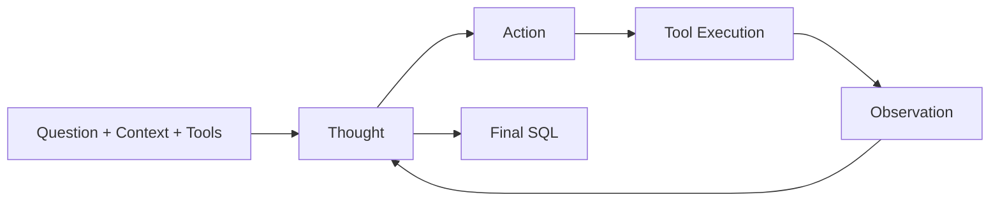

## 3. Plan-and-Solve 流程

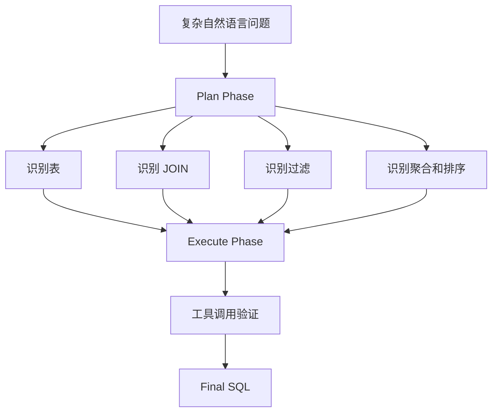

## 4. Schema Linking 外键图

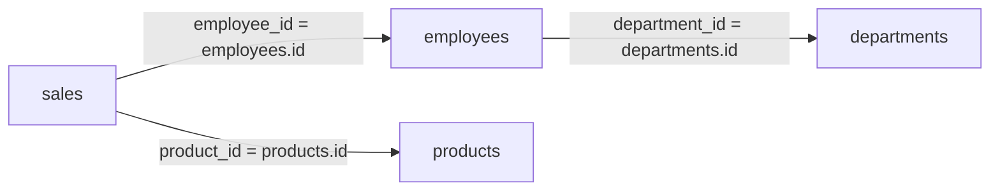

## 5. 自纠错闭环

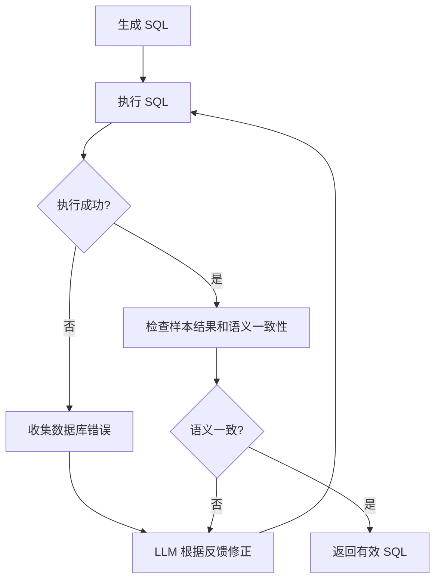

## 6. 测试金字塔

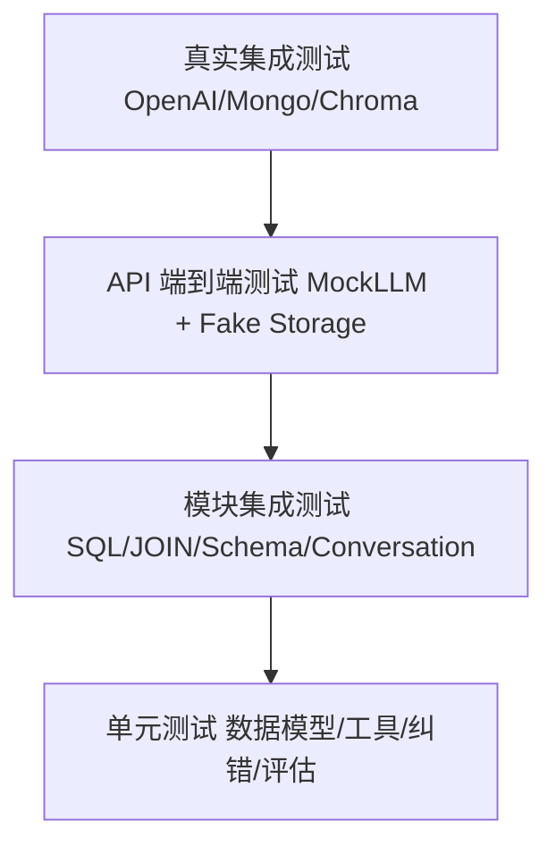

## 7. SemanticQueryPlan 编译链路

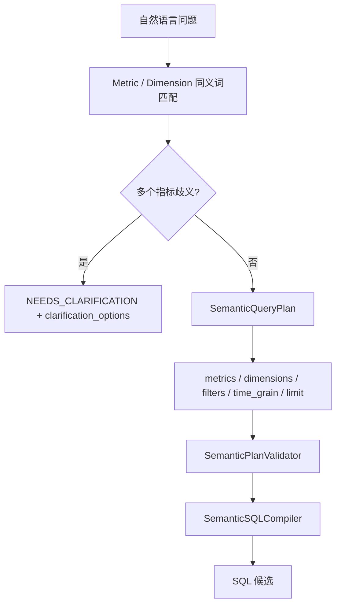

## 8. CandidateRanker 可解释决策

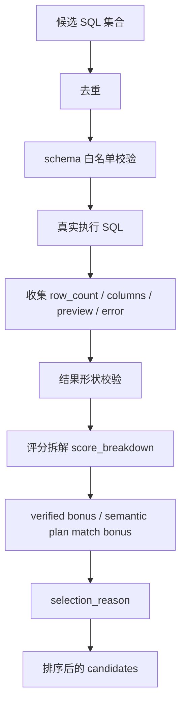

## 9. Grounded Result Analysis

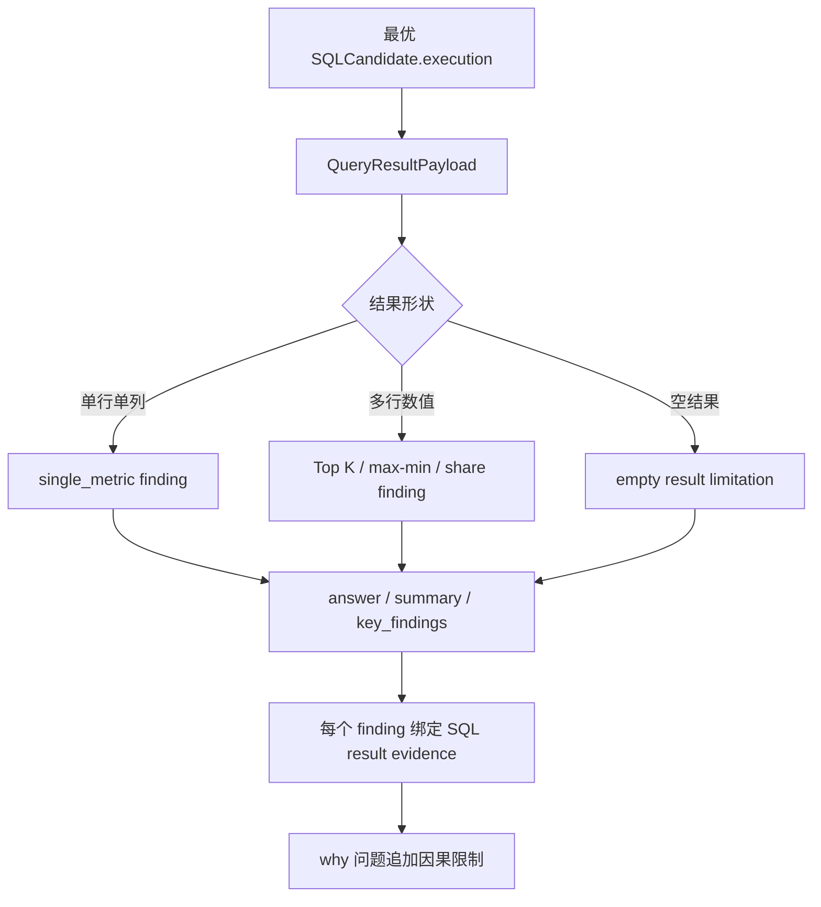

## 10. Visualization 2.0

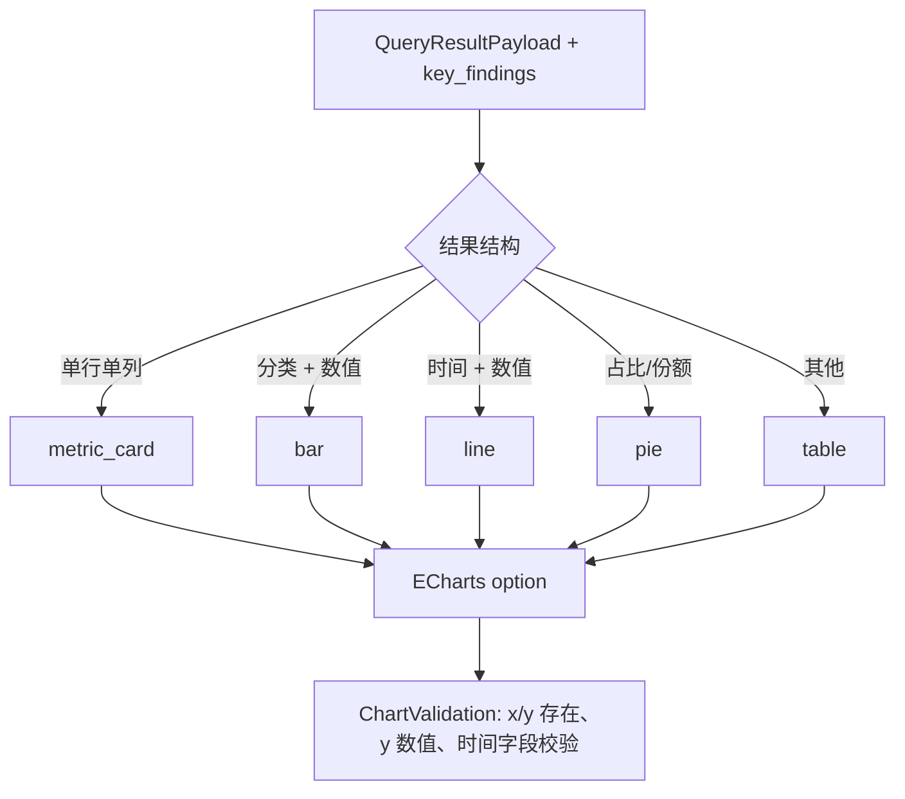

## 11. Feedback + Evaluation Loop

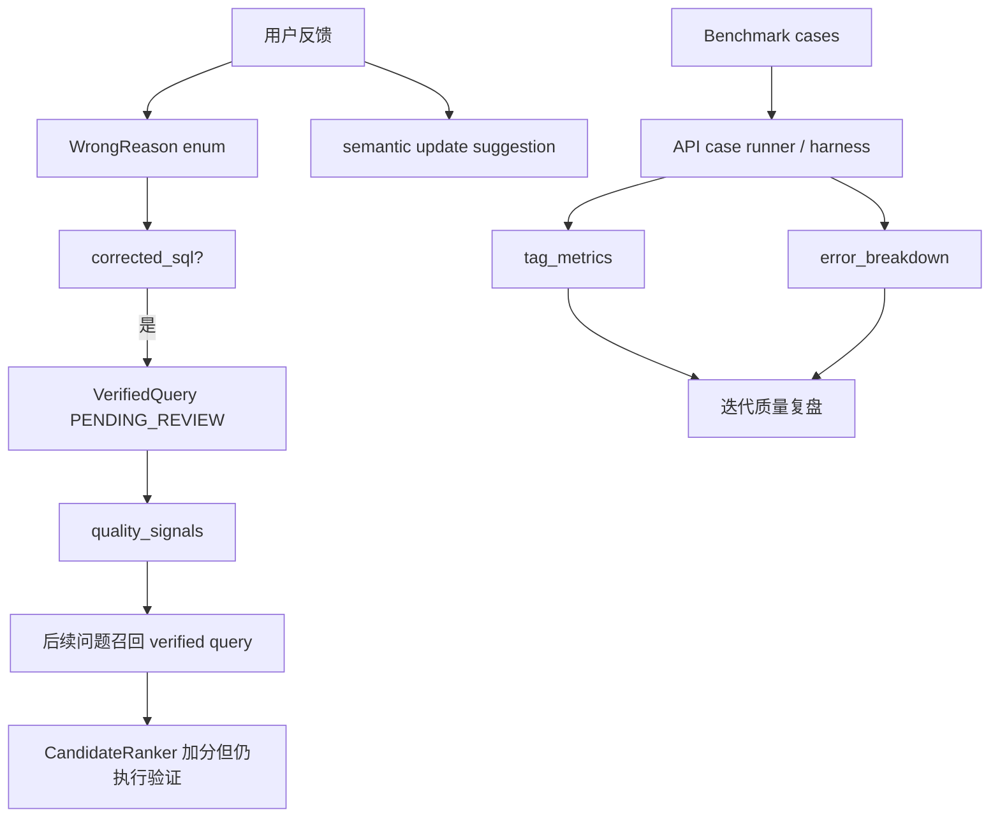

## 12. IoC 组件实例化

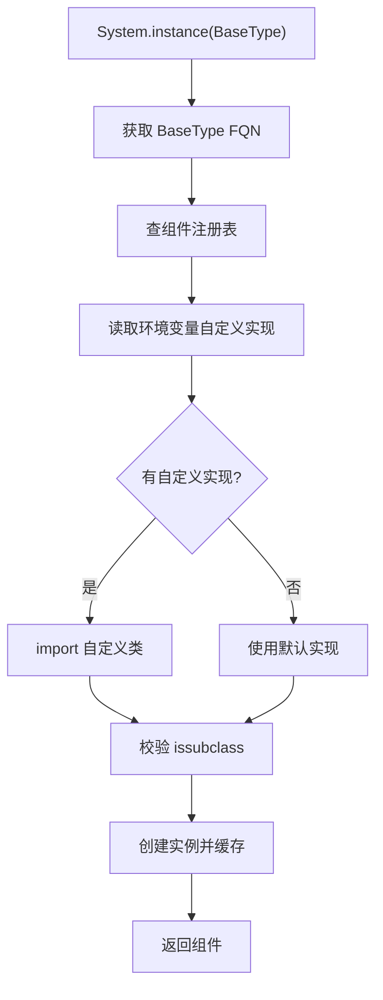
